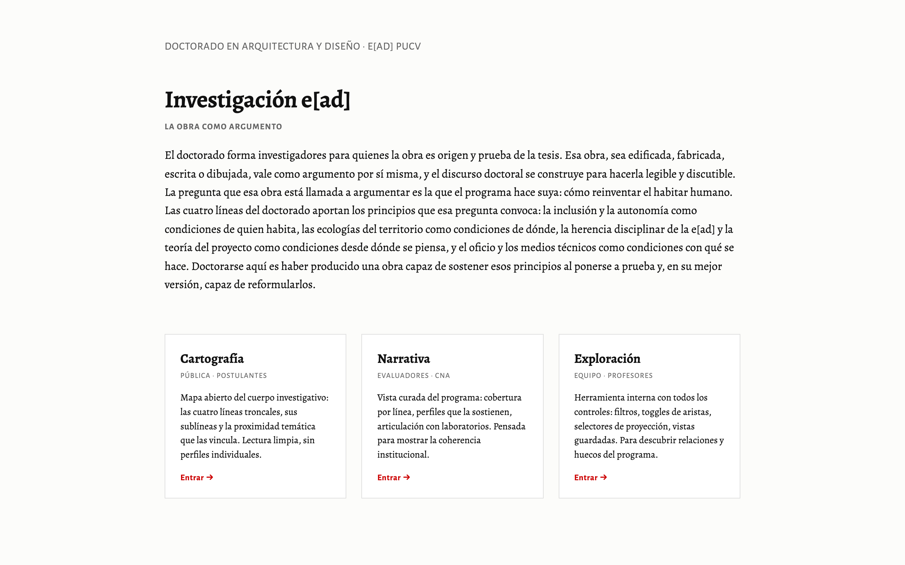
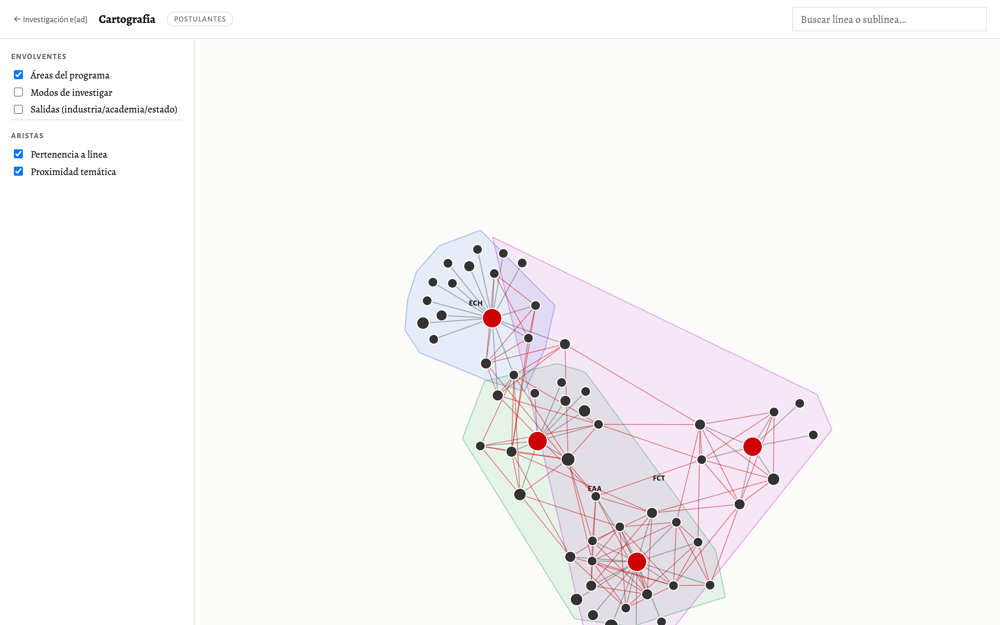
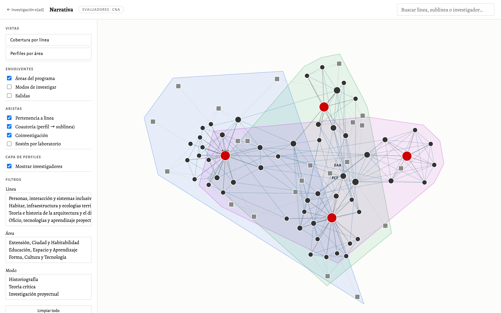
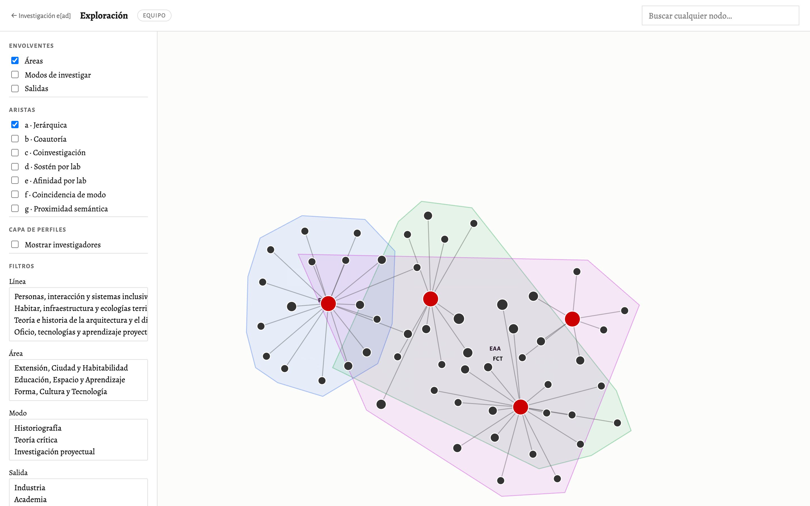

# Investigación e[ad]

Mapa dinámico del cuerpo investigativo del **Doctorado en Arquitectura y Diseño** de la e[ad] PUCV. Las cuatro líneas troncales del programa, sus sublíneas y los profesores que las cultivan, en una visualización interactiva que se alimenta directamente de una planilla colaborativa.

> *La obra como argumento.* El doctorado forma investigadores para quienes la obra es origen y prueba de la tesis. La pregunta que esa obra está llamada a argumentar: **cómo reinventar el habitar humano**.

| | |
|---|---|
| **Visualización** | [eadpucv.github.io/investigacion-ead](https://eadpucv.github.io/investigacion-ead/) |
| **Documento institucional** | [lineas-investigacion.md](./lineas-investigacion.md) |
| **Planilla colaborativa** | [Google Sheet](https://docs.google.com/spreadsheets/d/1Vbua3waIfGyszVnu3vr6qv2KvwVqK1zIHnZIrIEaFzQ/edit) |

## Cómo funciona

Los datos —líneas, sublíneas, investigadores, temas, áreas, modos, salidas, laboratorios y sus relaciones m:n— viven en una planilla compartida de Google Sheets. La visualización los carga **en vivo** mediante la API `gviz`. No hay paso intermedio de regeneración: la planilla es la fuente de verdad y cualquier edición se refleja en la visualización con sólo refrescar el navegador.

```
Google Sheet  ──gviz──►  data-loader.js  ──►  graph.js  ──►  superficies HTML
   (editable)                (parser CSV +              (D3 force-directed)
                              cómputo de aristas)
```

Para actualizar la visualización:

1. Editar cualquier pestaña en el [Google Sheet](https://docs.google.com/spreadsheets/d/1Vbua3waIfGyszVnu3vr6qv2KvwVqK1zIHnZIrIEaFzQ/edit).
2. Refrescar la página de la visualización (la caché de `gviz` puede demorar hasta unos minutos).

## Las tres superficies

Las tres páginas comparten el mismo motor (`graph.js`) pero exponen controles, aristas y nodos distintos según su audiencia:

- [**Cartografía**](https://hspencer.github.io/mad-map/cartografia.html) · *postulantes* — las 4 líneas y sus sublíneas como territorio temático, sin perfiles individuales.
- [**Narrativa**](https://hspencer.github.io/mad-map/narrativa.html) · *evaluadores · CNA* — activa la capa de profesores y dos vistas predefinidas: *cobertura por línea* y *perfiles por área*.
- [**Exploración**](https://hspencer.github.io/mad-map/exploracion.html) · *equipo del doctorado* — todos los controles: los siete tipos de aristas como toggles, filtros completos por línea/área/modo/salida/laboratorio/investigador, y búsqueda.

Cada superficie tiene una columna lateral de controles y una zona principal con el grafo. Click en cualquier nodo abre el panel de detalle al lado derecho. Hover muestra tooltip con el nombre. Drag reposiciona temporalmente; soltarlo deja que las fuerzas reacomoden.

## Documento institucional

[`lineas-investigacion.md`](./lineas-investigacion.md) describe formalmente cada línea: alcance temático, pregunta nuclear, cuerpo académico que la sostiene y argumentación de su consolidación y sostenibilidad. Pensado para audiencia institucional (CNA, comité doctoral, autoridades).

Para regenerarlo después de una edición significativa de la planilla:

```bash
python3 build_data.py     # snapshot Google Sheet → JSON local
python3 build_doc.py      # JSON → lineas-investigacion.md
```

(Sólo es necesario regenerar cuando cambia el cuerpo académico, las sublíneas o las descripciones de las líneas; no para cada edición menor del Sheet.)

---

## Guía para editores de la planilla

Todo lo que ves en las visualizaciones viene directamente de la [planilla colaborativa de Google Sheets](https://docs.google.com/spreadsheets/d/1Vbua3waIfGyszVnu3vr6qv2KvwVqK1zIHnZIrIEaFzQ/edit). Esta sección explica cómo se construye el layout de cada vista, qué define la cercanía entre nodos y cómo cada pestaña de la planilla incide en lo que se ve.

### Las tres superficies

| | |
|---|---|
|  | **Portada** — tres tarjetas de entrada. El sello formativo aparece como encabezado. |
|  | **Cartografía** (postulantes) — sólo líneas y sublíneas. Aristas por defecto: pertenencia a línea + proximidad temática. Envolventes de área activadas. |
|  | **Narrativa** (evaluadores · CNA) — vista "Perfiles por área": investigadores como cuadrados grises conectados a las sublíneas que cultivan. |
|  | **Exploración** (equipo) — todos los filtros disponibles. Vista por defecto: sólo aristas jerárquicas, 4 polos bien definidos. |

---

### Cómo se construye el layout espacial

El layout es un **grafo force-directed** (biblioteca D3, v7). No hay coordenadas fijas: cada nodo tiene una masa y cada arista actúa como un resorte. El motor de física corre hasta que el sistema se estabiliza.

#### Los tres tipos de nodo y su masa

| Tipo | Forma visual | Repulsión (carga) | Rol en el layout |
|---|---|---|---|
| **Línea troncal** | Círculo rojo grande | −1 000 | Ancla de polo. Con sólo 4 líneas y repulsión alta, se separan y ocupan las cuatro esquinas del espacio. |
| **Sublínea** | Círculo negro mediano | −180 | Orbita alrededor de su línea-madre. El tamaño crece con el número de investigadores que la cultivan. |
| **Investigador/a** | Cuadrado gris | −60 | Ligero, se interpone entre las sublíneas que cultiva cuando la capa de perfiles está activa. |

La repulsión de las líneas es tan alta respecto a las sublíneas que, incluso sin activar aristas, las 4 líneas se dispersan formando 4 polos. Las sublíneas quedan orbitando a distancia moderada; los investigadores flotan cerca de sus sublíneas.

#### Las 7 aristas como fuerzas de atracción

Cada tipo de arista es un resorte con distancia natural y rigidez propias. **Activar un tipo de arista = añadir una fuerza de atracción** entre los nodos que cumplen esa relación. El resultado es que esos nodos se acercan en pantalla.

| Letra | Nombre | Qué la genera (pestaña del Sheet) | Distancia natural | Rigidez | Lectura visual |
|---|---|---|---|---|---|
| **a** | Jerárquica | `02_Sublineas` → columna `linea_id` | 45 px | 0.85 (alta) | Mantiene cada sublínea pegada a su línea-madre. Define los 4 clusters base. |
| **b** | Coautoría | `08_Temas` + `09_Sublinea_Tema` | 70 px | 0.35 | Une investigador con sublínea. Al activar perfiles, los investigadores se enclavan entre sus sublíneas. |
| **c** | Coinvestigación | Derivada de (b): dos sublíneas con investigador compartido | 130 px | 0.15 | Atrae sublíneas que comparten investigador, potencialmente entre líneas distintas. Revela cuerpos académicos transversales. |
| **d** | Sostén de lab | `10_Lab_Linea` | 130 px | 0.35 | Une laboratorio con línea. Revela qué infraestructura institucional sostiene qué territorio temático. |
| **e** | Afinidad por lab | Derivada de (d): sublíneas cuyas líneas-madre comparten lab | 200 px | 0.04 (baja) | Señal suave de afinidad institucional entre sublíneas. Influencia mínima en el layout. |
| **f** | Coincidencia de modo | `14_Linea_Modo` (sólo nivel `predominante`) | 220 px | 0.02 (muy baja) | Atracción casi imperceptible entre sublíneas de líneas con el mismo modo predominante de investigar. Útil como capa de fondo. |
| **g** | Proximidad semántica | `18_Proximidad_Tematica` | 90 px | 0.45 | La arista más expresiva después de la jerárquica. Acerca sublíneas con afinidad temática declarada, cruzando fronteras de línea. |

> **Clave de lectura:** dos sublíneas cercanas en pantalla comparten muchas aristas activas. La distancia no es semántica en sentido estricto —es gravitacional: más resortes = mayor atracción.

---

### Lo que cada pestaña del Sheet afecta en el layout

| Pestaña | Qué controla | Efecto inmediato al refrescar |
|---|---|---|
| `01_Lineas` | Nombres y descripciones de las 4 líneas | Etiquetas y panel de detalle de los 4 nodos rojos |
| `02_Sublineas` | Qué sublíneas existen y a qué línea pertenecen | Aristas jerárquicas **(a)** y los 4 clusters |
| `03_Areas` | Las 3 áreas del programa (ECH, EAA, FCT) | Qué sublíneas caben bajo cada envolvente de área |
| `04_Modos` | Modos de investigar | Envolventes de modo; aristas **(f)** si se activan |
| `05_Salidas` | Salidas (industria / academia / estado) | Envolventes de salida; disponibles como filtro en Exploración |
| `06_Laboratorios` | Laboratorios del programa | Aristas **(d)** y **(e)** |
| `07_Investigadores` | Cuerpo académico | Nodos cuadrados; tamaño de sublíneas que cultivan |
| `08_Temas` | Temas de investigación por investigador | Base de las aristas **(b)** y **(c)** |
| `09_Sublinea_Tema` | Qué tema se asocia a qué sublínea | Genera aristas **(b)** coautoría; modifica el tamaño de los nodos sublínea |
| `10_Lab_Linea` | Qué laboratorio sostiene qué línea | Aristas **(d)** sostén; base de aristas **(e)** afinidad por lab |
| `11_Lab_Salida` | Qué laboratorio produce qué tipo de salida | Filtros de salida en Exploración |
| `12_Investigador_Lab` | Qué investigador trabaja en qué lab | Filtros de lab en Exploración |
| `13_Investigador_Modo` | Modo de investigar de cada investigador | Filtros de modo en Exploración |
| `14_Linea_Modo` | Modos predominantes/presentes por línea | Aristas **(f)** coincidencia de modo (sólo nivel `predominante`) |
| `17_Sello` | Variante del sello formativo (marcar `ELEGIDO`) | Texto de carga animado en las superficies y encabezado de la portada (requiere regenerar snapshot, ver abajo) |
| `18_Proximidad_Tematica` | Pares de sublíneas con afinidad temática | Aristas **(g)** proximidad semántica — las más expresivas después de la jerarquía |

> Para la pestaña `18_Proximidad_Tematica`: las filas con columna `estado = DESCARTADO` se ignoran. Las demás deben estar en pares simétricos (A↔B y B↔A con el mismo valor de `afinidad`).

---

### ¿Hay que ejecutar scripts? ¿Cuándo y en qué orden?

**En la mayoría de los casos: no.** Edita la planilla, refresca el navegador, y los cambios se reflejan en las tres superficies. La única demora es la caché de `gviz`, que puede tardar hasta unos minutos.

Los scripts son necesarios sólo en dos situaciones:

#### 1. Actualizar el snapshot local (fallback offline + sello de la portada)

La portada (`index.html`) carga el sello desde el archivo local `mad-map-data.json`, no desde Sheets en vivo. Si cambias la variante elegida en `17_Sello` y quieres que la portada refleje el cambio, regenera el snapshot:

```bash
python3 build_data.py
```

Este script también actualiza el fallback que usan las tres superficies cuando Google Sheets no es accesible.

#### 2. Regenerar el documento institucional

Si cambian las descripciones de líneas, el cuerpo académico o las sublíneas, regenera el documento formal:

```bash
# Paso 1: actualizar snapshot local desde la planilla
python3 build_data.py

# Paso 2: generar el documento desde el snapshot
python3 build_doc.py
```

El resultado es [`lineas-investigacion.md`](./lineas-investigacion.md), pensado para audiencia institucional (CNA, comité doctoral).

> **Orden:** siempre `build_data.py` antes de `build_doc.py`. El documento se genera desde el JSON local, no directamente desde Sheets.

#### Resumen de scripts

| Script | Para qué | Necesita red |
|---|---|---|
| `python3 build_data.py` | Regenera `mad-map-data.json` desde la planilla | Sí (lee Google Sheets) |
| `python3 build_doc.py` | Regenera `lineas-investigacion.md` desde el JSON local | No |
| `python3 build_xlsx.py` | Inicializa/actualiza la estructura del `.xlsx` legacy | No |
| `python3 -m http.server 8765` | Corre el sitio localmente en `localhost:8765` | No |

---

## Especificación

La especificación formal del comportamiento del sistema (entidades, superficies, reglas, invariantes) está en [`mad-map.allium`](./mad-map.allium), en formato Allium v3.

## Versiones

| Branch | Modelo de datos | Estado |
|---|---|---|
| `main` | Google Sheets en vivo (`gviz`) | **Activa** |
| `v2` | Pipeline Python local con snapshot `.xlsx` | Snapshot del mapa pre-Sheets |
| `v1` | Mapa MAD legacy (Magíster) | Versión histórica con CSV publicado |

Cualquiera puede consultarse con `git checkout v1` o `git checkout v2`.

## Estructura del proyecto

```
.
├── index.html                  ← portada con sello + 3 tarjetas
├── cartografia.html            ← superficie pública (postulantes)
├── narrativa.html              ← superficie evaluadores · CNA
├── exploracion.html            ← superficie equipo del doctorado
├── graph.js                    ← motor de visualización (D3 force-directed)
├── data-loader.js              ← carga desde Google Sheets vía gviz
├── style.css                   ← estilos compartidos
├── d3.v7.min.js                ← biblioteca D3
├── lineas-investigacion.md     ← documento institucional formal
├── mad-map.allium              ← spec de comportamiento (Allium v3)
├── mad-map-data.json           ← snapshot local (fallback offline)
├── mad-map-data-v2.xlsx        ← snapshot local en formato xlsx
├── build_data.py               ← (opcional) regenera JSON local desde xlsx
├── build_doc.py                ← (opcional) regenera doc institucional
├── build_xlsx.py               ← (opcional) inicializa estructura del .xlsx
└── legacy.html                 ← visualización anterior del Magíster
```

## Modo offline

Si la red falla o el Sheet no es accesible, la visualización cae automáticamente al snapshot local `mad-map-data.json`. Para refrescar el snapshot:

```bash
python3 build_data.py
```

Para correr el sitio localmente:

```bash
python3 -m http.server 8765
# abrir http://localhost:8765/
```
